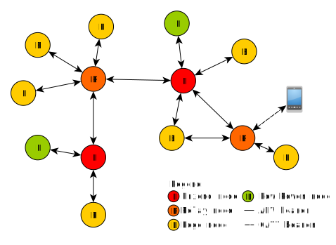
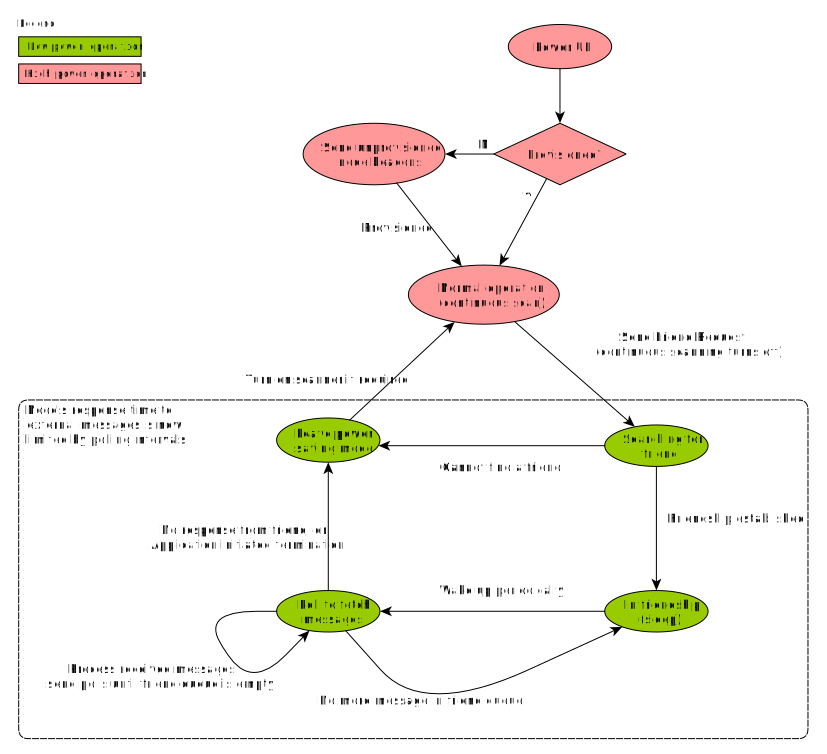

# Low Power node feature

A typical mesh network consist of a mix of relay and edge nodes. It uses a flooding approach to
increase the range of Bluetooth communication through relay nodes that re-broadcast received
mesh messages. The nodes that are actively participating in the network typically employ continuous
scanning for incoming advertising packets. However, continuous scanning requires a significant
amount of power and hence such nodes are typically wall-powered (for example, light bulbs).

There are certain use cases where battery-based operation is desired, for example,
battery-operated light switches or sensor nodes. In such cases, the node may not be able to do
continuous scanning, but still would want to participate in the mesh network to control and
communicate with other mesh nodes. To enable such use cases,
the Bluetooth Mesh specification defines a Low Power feature. A node that uses the Low Power
feature is called a Low Power node (LPN).
The LPN makes use of a special node, called Friend node, to participate in the mesh network with
 significantly shorter scanning duty cycles.

The following figure shows an example of network topology with LPNs and other mesh nodes.

@anchor fig-nw-topo

The LPN establishes a special relationship, called friendship, with a neighboring Friend node.
This node starts storing all mesh messages (security updates and regular messages) destined for
the befriended LPN in a cache known as the Friend Queue.
One Friend node can establish friendship with one or more LPNs.
The LPN wakes up periodically and polls the Friend node for any new messages. The
Friend node then delivers stored security updates and mesh messages to this LPN, one by one.

---

## LPN life cycle @anchor LPN_lifecycle

The following image shows a typical life cycle of the LPN.

When LPN boots for the first time, it sends out unprovisioned node beacons and waits to be
provisioned.

After the LPN is provisioned, the application firmware can finish its house keeping tasks (if any)
as part of the normal operation and start the friendship establishment procedure. As a result, the continuous scanning will be turned off, which will
reduce the power consumption of the device.

The mesh stack wakes up the device periodically to send Friend Poll messages to the Friend node and fetch any
messages that the Friend may have received.

If the device fails to get any response from the Friend node, the mesh
stack will terminate the friendship.

If required, the application firmware can also explicitly
terminate the friendship.

---

## More about LPN feature @anchor LPN_more_info

Read the following pages for more information about the Low Power node feature support in the nRF5 SDK for Mesh:
- @ref md_doc_getting_started_lpn_integration, if you want to start integrating the LPN feature into your application;
- @ref md_examples_experimental_lpn_README, if you want to see how a device that supports the Low Power node (LPN) feature works.

For information about high level LPN feature APIs offered by the nRF5 SDK for Mesh, check the @ref MESH_LPN page.